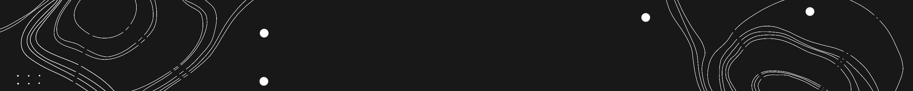

### О себе:

Постоянно следую за новыми тенденциями и лучшими практиками в веб-разработке.

### Tech stack:

#### General

<table width='100%'>
  <tr>
    <td align="center" width="110" height="90">
        
       JavaScript
    </td>
    <td align="center" width="110" height="90">
        
       TypeScript
    </td>
    <td align="center" width="110" height="90">
        
       Docker
    </td>
    <td align="center" width="110" height="90">
        
       Git
    </td>
    <td align="center" width="110" height="90">
        
       npm
    </td>
    <!--<td align="center" width="110" height="90">
        
       yarn
    </td>-->
        <td align="center" width="110" height="90">
        
       HTML5
    </td>
         <td align="center" width="110" height="90">
        
       CSS3
    </td>
    <td align="center" width="110" height="90">
        
       Figma
    </td>
  </tr> 
</table>

#### Frontend

<table width='100%'>
  <tr>
   <td align="center" width="110" height="90">
        
       React JS
    </td>
     <td align="center" width="110" height="90">
        
       Next JS
    </td>
   <td align="center" width="110" height="90">
        
       Redux
    </td>
    <td align="center" width="110" height="90">
        
       MobX
    </td>
     <!--<td align="center" width="110" height="90">
        
       Apollo
    </td>-->
    <!--<td align="center" width="110" height="90">
        
       Webpack
    </td>-->
    <td align="center" width="110" height="90">
        
       Vite
    </td> 
    <td align="center" width="110" height="90">
        
       Sass
    </td>
     <td align="center" width="110" height="90">
        
       SC 
    </td>
  </tr> 
    <tr>
     <td align="center" width="110" height="90">
        
       MUI
    </td>
   <!--<td align="center" width="110" height="90">
        
       Bootstrap
    </td>-->
   <td align="center" width="110" height="90">
        
       Tailwind
    </td>
  </tr> 
</table>

#### Testing
<table width='100%'>
  <tr>
     <td align="center" width="110" height="90">
        
       Jest
    </td>
    <!--<td align="center" width="110" height="90">
        
       Cypress
    </td>
        <td align="center" width="110" height="90">
        
       Storybook
    </td>-->
  </tr> 
</table>

#### Code quality

<table width='100%'>
  <tr>
     <td align="center" width="110" height="90">
        
       ESLint 
    </td>
    <td align="center" width="110" height="90">
        
       Prettier
    </td>
        <td align="center" width="110" height="90">
        
       Sylelint
    </td>
  </tr> 
</table>

#### Backend

<table width='100%'>
  <tr>
    <td align="center" width="110" height="90">
        
       GraphQL
    </td>
    <td align="center" width="110" height="90">
        
       Node JS
    </td>
    <td align="center" width="110" height="90">
   
       Express JS
    </td>
    <td align="center" width="110" height="90">
        
       MongoDB
  </tr> 
</table>

---
<!--
### Контакты:

-->
